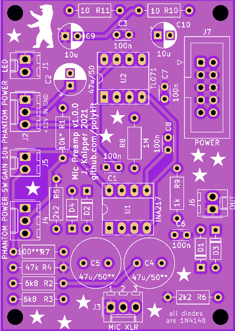

# Microphone preamp with phantom power

This repository contains schematics and PCB of a microphone preamp with switchable phantom power. It is based on the INA217 low-noise instrumentation amplifier. An additional buck-boost converter is needed for a phantom power higher than 12V. 

## BOM

|Reference      |Quantity|Value           |Note                           |
|---------------|--------|----------------|-------------------------------|
|C1 C3 C6 C7 C8 |5       |100n            |Ceramic caps                   |
|C9 C10         |2       |10u             |                               |
|C2             |1       |47u/50          |                               |
|C4 C5          |2       |47u/50**        |Bipolar caps                   |
|D1 D2 D3 D4    |4       |1N4148          |                               |
|J1             |1       |LED             |Molex KK 2.54mm 2-pin connector|
|J2             |1       |PHANTOM POWER   |Molex KK 2.54mm 3-pin connector|
|J3             |1       |MIC XLR         |Molex KK 2.54mm 3-pin connector|
|J4             |1       |PHANTOM POWER SW|Molex KK 2.54mm 3-pin connector|
|J5             |1       |GAIN 10k        |Molex KK 2.54mm 2-pin connector|
|J6             |1       |OUT             |Molex KK 2.54mm 2-pin connector|
|J7             |1       |POWER           |10-pin IDC connector           |
|R1             |1       |10k*            |                               |
|R10 R11        |2       |10              |                               |
|R2 R3          |2       |6k8             |                               |
|R4             |1       |47k             |                               |
|R5 R6          |2       |2k2             |                               |
|R7             |1       |100***          |                               |
|R8             |1       |1M              |                               |
|R9             |1       |1k              |                               |
|U1             |1       |INA217          |DIP-8 package                  |
|U2             |1       |TL071           |                               |
|               |1       |XLR socket      |Microphone input socket        |
|               |1       |Output jack     |                               |
|               |1       |10k pot         |                               |
|               |1       |Switch SPDT     |ON-ON                          |
|               |1       |LED             |                               |

\* LED current limiting resistor, change value according to used phantom power, 10k is for 48V

\** use bipolar caps

\*** adjust to change max. gain, smaller is more gain

## Reference

https://www.ti.com/lit/ds/symlink/ina217.pdf
